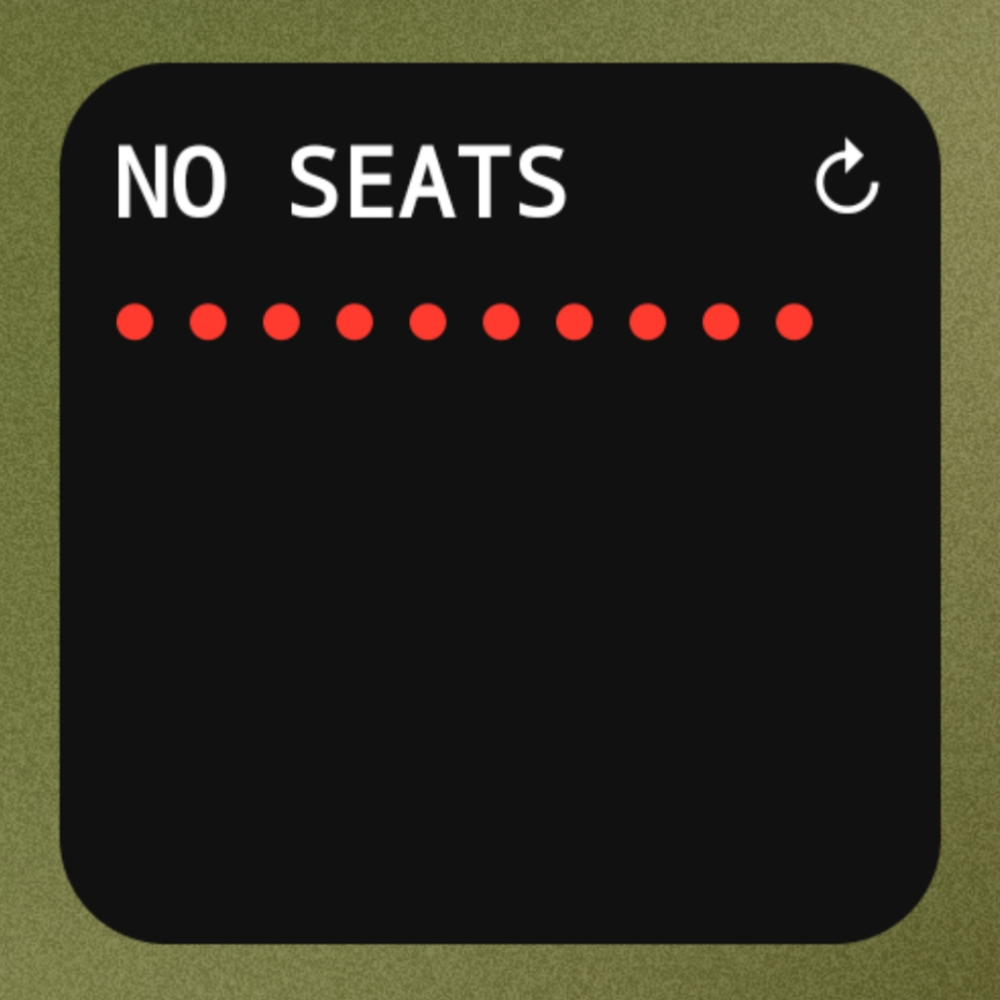
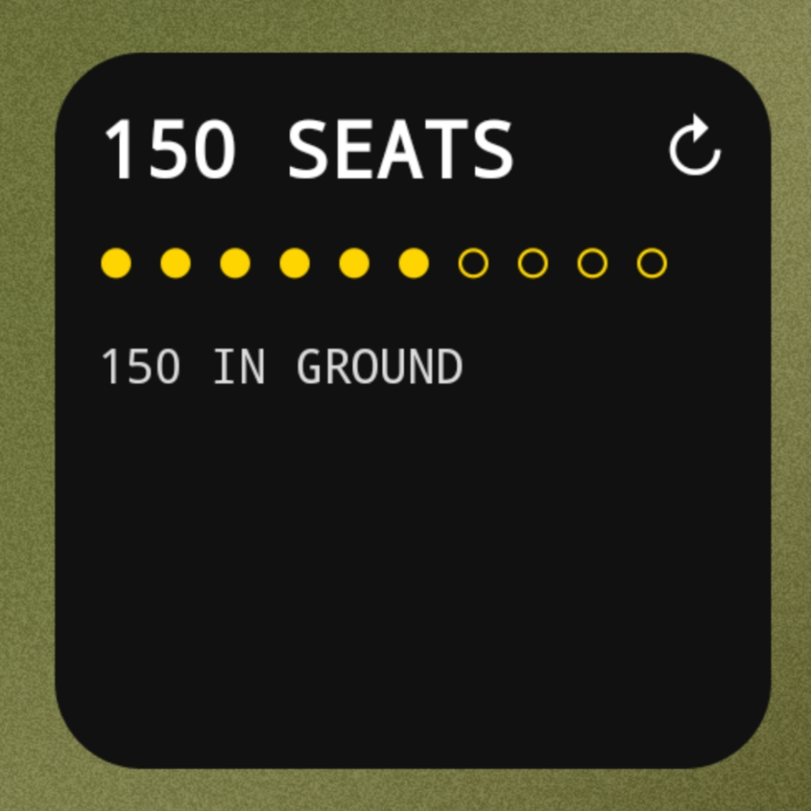
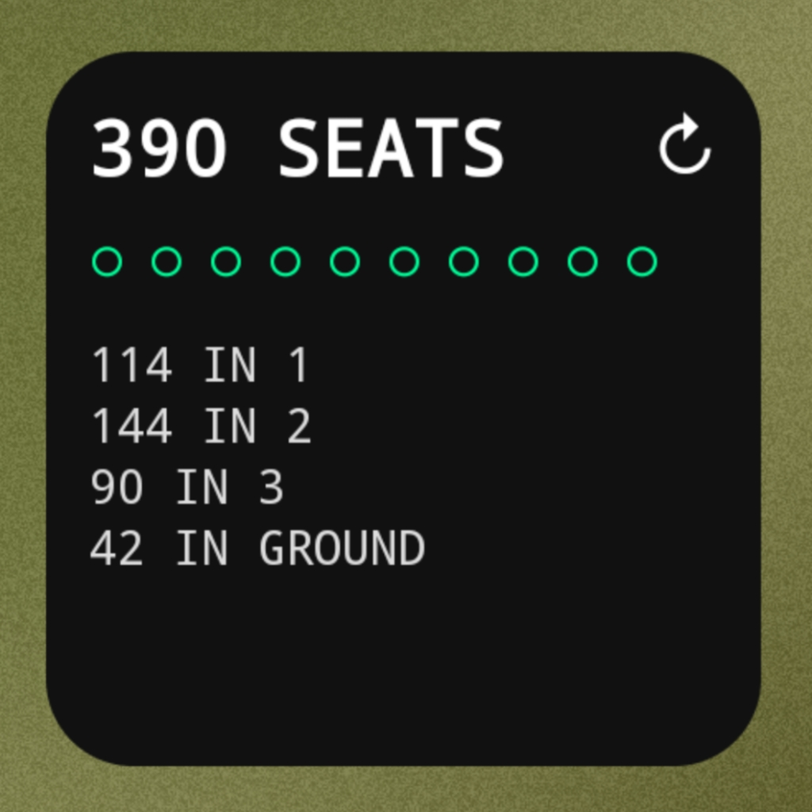
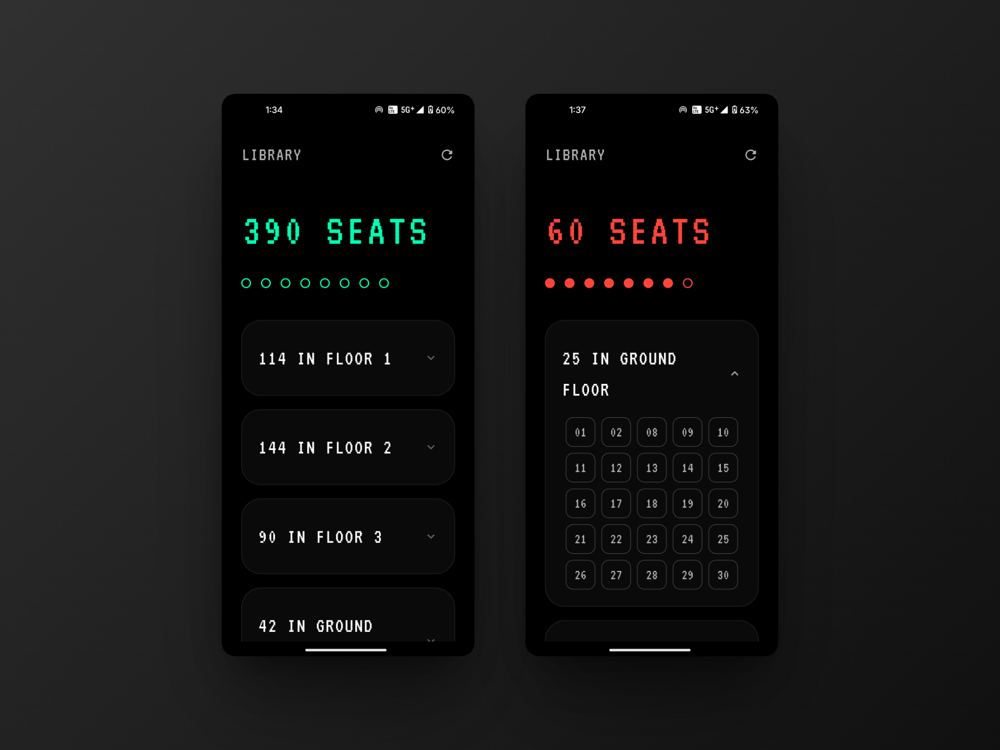

<div align="center">


# spotNITJ

**Real-time library seat availability for NIT Jalandhar**

[](https://flutter.dev)
[](https://dart.dev)
[](LICENSE)
[](https://github.com/opensource-nitj)

<br/>

_Never walk to the library to find it full again._

<br/>

</div>

---

## What it does

spotNITJ gives you live seat availability across the NIT Jalandhar library - from your phone, your home screen widget, or a notification. Built with a minimal, dark-first design.

---

## Screenshots

|               Low Availability               |               Med Availability               |               High Availability                |
| :------------------------------------------: | :------------------------------------------: | :--------------------------------------------: |
|  |  |  |

### UI:



---

## Features

- **Live tracking** - seat counts refresh in real time via the [OpensourceNITJ/api](https://github.com/Opensource-NITJ/api)
- **Seat categories** - view availability by section or floor
- **Home screen widgets** - glanceable Android widgets in multiple sizes
- **Smart notifications** - get alerted when seats open up in your preferred section
- **Minimal UI** - clean dark interface, nothing you don't need
- **Lightweight** - fast refresh, low battery impact

---

## Getting Started

### Prerequisites

- [Flutter SDK](https://docs.flutter.dev/get-started/install) (3.x or later)
- Android Studio or VS Code with Flutter extension
- A device or emulator running Android 8.0+

### Installation

```bash
# Clone the repo
git clone https://github.com/opensource-nitj/spotNITJ.git
cd spotNITJ

# Install dependencies
flutter pub get

# Run the app
flutter run
```

---

## Tech Stack

| Layer         | Technology                            |
| ------------- | ------------------------------------- |
| Framework     | Flutter / Dart                        |
| Widgets       | Android App Widgets (via home_widget) |
| Notifications | Flutter Local Notifications           |
| Data          | REST API (api.opensourcenitj.com)     |

---

## Contributing

Contributions are welcome - bug fixes, new features, UI improvements, or documentation.

1. Fork the repo
2. Create a branch: `git checkout -b feature/your-feature`
3. Commit your changes: `git commit -m 'Add some feature'`
4. Push and open a Pull Request

For larger changes, please open an issue first to discuss the approach.

---

## License

MIT License - see [LICENSE](LICENSE) for details.

---

<div align="center">

Built with 💙 by students at NIT Jalandhar · [OpenSource@NITJ](https://github.com/opensource-nitj)

</div>
